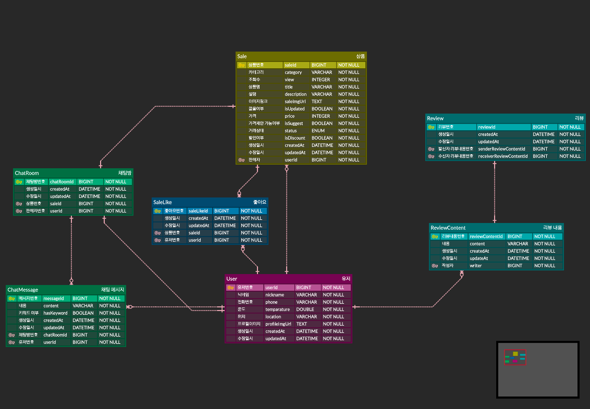

# 클디서 합동 세미나 - 모바일4조 [당근마켓]

## 🧸 Team

|    **[강수현](https://github.com/onpyeong)**    |   **[박예준](https://github.com/jun02160)**   |
|:--------------------------------------------:|:------------------------------------------:|
|                  PM, 서버 개발자                  |                   서버 개발자                   |
| 서버 배포<br/>DB 설계<br />Sale, User API 개발<br /> | 프로젝트 세팅<br />DB 설계<br/>Chat, Review API 개발 |

💖 협업 노션 페이지 - https://www.notion.so/go-sopt/Server-13aa6b78aa744fb480fcb26928dcbb49?pvs=4

## 🛠️ 개발 환경

| 통합 개발 환경 | IntelliJ |
| --- | --- |
| Spring 버전 | 2.7.11 |
| 데이터베이스 | AWS RDS(MySQL) |
| 배포 | AWS EC2(Ubuntu), S3|
| Project 빌드 관리 도구 | Gradle |
| CI/CD 툴 | Github Actions |
| ERD 다이어그램 툴 | ERDCloud |
| Java version | Java 11  |
| 패키지 구조 | 도메인 패키지 구조 |


### 프로젝트 폴더 구조

- 자세히 보기 👈🏻

    ```java
    ── src
        ├── main
        │   ├── java
        │   │   └── sopt
        │   │       └── org
        │   │           └── CarrotServer
        │   │               ├── CarrotServerApplication.java
        │   │               ├── common
        │   │               │   ├── advice
        │   │               │   │   └── ControllerExceptionAdvice.java
        │   │               │   ├── config
        │   │               │   │   └── S3Config.java
        │   │               │   └── dto
        │   │               │       └── ApiResponse.java
        │   │               ├── controller
        │   │               │   ├── chat
        │   │               │   │   ├── ChatController.java
        │   │               │   │   └── dto
        │   │               │   │       ├── request
        │   │               │   │       │   ├── CreateChatMessageRequestDto.java
        │   │               │   │       │   └── CreateChatRoomRequestDto.java
        │   │               │   │       └── response
        │   │               │   │           ├── ChatMessageResponseDto.java
        │   │               │   │           ├── ChatResponseDto.java
        │   │               │   │           └── ChatRoomRepsonseDto.java
        │   │               │   ├── review
        │   │               │   │   ├── ReviewController.java
        │   │               │   │   └── dto
        │   │               │   │       ├── request
        │   │               │   │       │   ├── CreateReviewContentRequestDto.java
        │   │               │   │       │   ├── CreateReviewRequestDto.java
        │   │               │   │       │   └── ReviewRequestDto.java
        │   │               │   │       └── response
        │   │               │   │           ├── ReviewContentResponseDto.java
        │   │               │   │           └── ReviewResponseDto.java
        │   │               │   ├── sale
        │   │               │   │   ├── SaleController.java
        │   │               │   │   ├── SaleLikeController.java
        │   │               │   │   └── dto
        │   │               │   │       ├── request
        │   │               │   │       │   ├── CreateSaleRequestDto.java
        │   │               │   │       │   └── SaleLikeRequestDto.java
        │   │               │   │       └── response
        │   │               │   │           ├── SaleDetailDto.java
        │   │               │   │           ├── SaleDetailResponseDto.java
        │   │               │   │           ├── SaleInfoDto.java
        │   │               │   │           ├── SaleLikeResponseDto.java
        │   │               │   │           ├── SaleResponseDto.java
        │   │               │   │           ├── SaleSimpleResponseDto.java
        │   │               │   │           └── SellerSaleResponseDto.java
        │   │               │   └── user
        │   │               │       ├── UserController.java
        │   │               │       └── dto
        │   │               │           ├── request
        │   │               │           │   └── CreateUserRequestDto.java
        │   │               │           └── response
        │   │               │               ├── UserDetailResponseDto.java
        │   │               │               └── UserResponseDto.java
        │   │               ├── domain
        │   │               │   ├── BaseTimeEntity.java
        │   │               │   ├── chat
        │   │               │   │   ├── ChatMessage.java
        │   │               │   │   └── ChatRoom.java
        │   │               │   ├── review
        │   │               │   │   ├── Review.java
        │   │               │   │   ├── ReviewCategory.java
        │   │               │   │   └── ReviewContent.java
        │   │               │   ├── sale
        │   │               │   │   ├── Sale.java
        │   │               │   │   ├── SaleLike.java
        │   │               │   │   ├── SaleLikeId.java
        │   │               │   │   ├── SaleStatus.java
        │   │               │   │   └── SaleStatusConverter.java
        │   │               │   └── user
        │   │               │       └── User.java
        │   │               ├── exception
        │   │               │   ├── ErrorStatus.java
        │   │               │   ├── SuccessStatus.java
        │   │               │   └── model
        │   │               │       ├── CustomException.java
        │   │               │       └── NotFoundException.java
        │   │               ├── infrastructure
        │   │               │   ├── chat
        │   │               │   │   ├── ChatMessageRepository.java
        │   │               │   │   └── ChatRoomRepository.java
        │   │               │   ├── review
        │   │               │   │   ├── ReviewContentRepository.java
        │   │               │   │   └── ReviewRepository.java
        │   │               │   ├── sale
        │   │               │   │   ├── SaleLikeRepository.java
        │   │               │   │   └── SaleRepository.java
        │   │               │   └── user
        │   │               │       └── UserRepository.java
        │   │               └── service
        │   │                   ├── chat
        │   │                   │   └── ChatService.java
        │   │                   ├── review
        │   │                   │   ├── ReviewContentService.java
        │   │                   │   └── ReviewService.java
        │   │                   ├── sale
        │   │                   │   └── SaleService.java
        │   │                   └── user
        │   │                       └── UserService.java
        │   └── resources
        │       ├── application.yaml
        └── test
    ```


### API 명세서

📄 [API Docs](https://www.notion.so/go-sopt/eee8e182747e47d985692322432f9e59?v=53f2ee88c7c046b98c868c42f4a5873a&pvs=4)

### 데이터베이스 ERD


[📓 DB 설계](https://www.notion.so/DB-cc20d8bf635749d6a0238e1e4c7e878d)

# 👥 Backend Convention

## 브랜치 컨벤션

- [feature] : 기능 추가
- [fix] : 에러 수정, 버그 수정
- [docs] : README, 문서
- [refactor] : 코드 리펙토링 (기능 변경 없이 코드만 수정할 때)
- [modify] : 코드 수정 (기능의 변화가 있을 때)
- [chore] : gradle 세팅, 위의 것 이외에 거의 모든 것

### 브랜치 명 예시

`ex) feature/#issue-user-APi`

## 커밋 컨벤션

- ✅ `[CHORE]` : 동작에 영향 없는 코드 or 변경 없는 변경사항(주석 추가 등)
- ✨ `[FEAT]` : 새로운 기능 구현
- ➕ `[ADD]` : Feat 이외의 부수적인 코드 추가, 라이브러리 추가, 새로운 파일 생성
- 🔨 `[FIX]` : 버그, 오류 해결
- ⚰️ `[DEL]` : 쓸모없는 코드 삭제
- 📝 `[DOCS]` : README나 WIKI 등의 문서 수정
- ✏️ `[CORRECT]` : 주로 문법의 오류나 타입의 변경, 이름 변경시
- ⏪️ `[RENAME]` : 파일 이름 변경시
- ♻️ `[REFACTOR]` : 전면 수정
- 🔀 `[MERGE]`: 다른 브랜치와 병합

### 커밋 예시

`ex ) git commit -m "[FEAT] 회원가입 기능 완료"`

## 이슈 컨벤션

- [feat] : 기능 추가
- [fix] : 에러 수정, 버그 수정
- [docs] : README, 문서
- [refactor] : 코드 리펙토링 (기능 변경 없이 코드만 수정할 때)
- [modify] : 코드 수정 (기능의 변화가 있을 때)
- [chore] : gradle 세팅, 위의 것 이외에 거의 모든 것

## 코드 컨벤션

### Naming

- 변수는 camelCase를 기본으로 → userEmail, userCellPhone
- ENUM이나 상수는 대문자로 네이밍
- URL, 파일명 등은 kebab-case를 사용한다. → /user-email-page ...
- 함수명은 소문자로 시작하고 동사로 네이밍 → getUserId(), isNormal()
- 패키지명은 소문자로
    - 언더스코어나 대문자 섞지 X
- 클래스명은 UpperCamelCase를 사용하고 명사로 작성 → UserEmail, Address
- 예외를 던질때는 세부적인 Custom Exception으로 던진다
- 메소드와  클래스는 쪼개서 최대한 작게 만든다.
